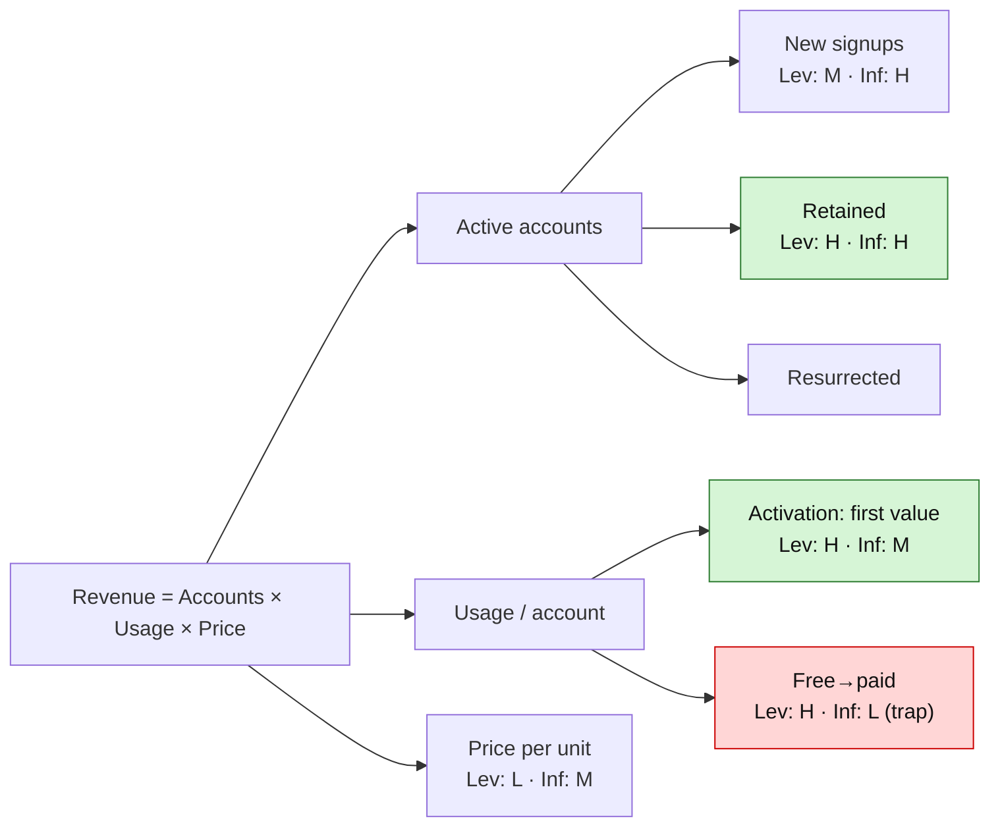

# Product Growth Diagnosis

## What this skill does

It helps someone figure out **where to focus their product growth efforts** — not by guessing, but by
mapping the full opportunity space and then filtering it down to a small, defensible shortlist. The
output is a "growth map" (a driver tree) and a ranked list of focus areas, ending with a clear top 3.

The core belief: most teams waste effort on low-leverage work, or on drivers they can't actually
move, or on one-off wins that don't compound. A good diagnosis steers them toward areas that are
**high-leverage, genuinely influenceable, and compounding.**

This skill stops at *where to focus*. Designing the specific experiments/interventions for a chosen
focus area is a separate job — hand off cleanly at the end (see "Closing the diagnosis").

## The method, end to end

1. **Understand the situation** (conversational intake).
2. **Define the objective** — the single success metric to drive. This becomes the root of the tree.
3. **Build the driver tree** — decompose the objective into its drivers; this is the growth map.
4. **Find the leverage** — where would improvement have outsized impact?
5. **Assess influence** — how much can this team actually move each driver?
6. **Assess compounding** — would success loop and build on itself over time / across metrics?
7. **Rank into a shortlist** with reasoning, and surface a top 3.
8. **Deliver the markdown growth map** and close with a handoff.

Work through these conversationally. Don't interrogate the user with a giant form — pull what you
need as the conversation flows, and start building the tree as soon as you have enough.

## Step 1 — Understand the situation

Gather these naturally over the conversation (not as a checklist read aloud):

- **The objective** they care most about (and why now).
- **Business model** — this shapes the whole tree (SaaS, marketplace, e-commerce, subscription,
  fintech, ad-supported, social/UGC, usage-based, token-based AI). Ask if unclear.
- **A quick outline** of the product, the company, and the ideal user.
- **Stage** — pre-PMF, early traction, scaling? (Changes what "leverage" looks like.)
- **Current metrics** if they have them. If they don't, that's fine — you'll score High/Medium/Low.
- **What they've already tried** — both wins and dead ends.
- **Key pains / opportunities** they're already chasing or worried about.

If the user is vague, make reasonable assumptions, state them, and move forward — a diagnosis that
keeps moving beats one stuck waiting for perfect inputs.

## Step 2 — Define the objective

Pin down one top-level success metric (e.g. MAU, ARR, GMV, paid conversion). If they name several,
help them choose the one that matters most right now; the others usually show up as drivers inside
the tree anyway. The objective sits at the root: **the tree is objective × business model.**

## Step 3 — Build the driver tree (the growth map)

Read `references/driver-trees.md` and pull the template matching their business model. Then adapt it
to their actual product. A strong tree:

- Is **3–5 layers deep** — shallow trees hide the real drivers.
- Has branches that are **MECE** (mutually exclusive, collectively exhaustive) — or close enough that
  nothing important is missing.
- Is **multiplicative** where possible (e.g. `Revenue = Traffic × Conversion × AOV × Frequency`), so
  the math of leverage is visible. It's fine to start *thematic* and harden into formulas over time.
- **Nests two shapes:** a multiplicative tree at the top, with **additive growth-accounting**
  (`New + Retained + Resurrected − Churned`) at any "active users" or "recurring revenue" leaf. This
  nesting is the most important structural move — explain it to the user as you do it.

If their objective isn't the template's natural root, **re-root** the tree onto their objective and
pull the relevant branches up.

Where the user lacks hard numbers, annotate each node **H/M/L** for volume and for
conversion/drop-off based on what they do know. Estimates are enough to find leverage.

Render the tree as a **Mermaid diagram** so it genuinely reads as a map — see "Rendering the growth
map" below for the exact pattern to follow.

### Rendering the growth map (Mermaid)

Draw the tree as a Mermaid `flowchart LR` (left-to-right reads best for wide trees; use `TD`
top-down for narrow ones). This keeps the map inside the markdown as editable text while rendering
as a real diagram on GitHub, Obsidian, Notion, and most viewers.

Encode the scoring visually so the map alone tells the story:

- **Structure** — the objective is the root; each layer branches into its drivers. Where a node is a
  *product* of its children, say so in the parent label (e.g. `Revenue = Accounts × Usage × Price`),
  so the multiplicative logic is visible.
- **Leverage & Influence scores on the candidate drivers** — on each driver you actually score,
  append the two lens reads, e.g. `Activation: first value<br/>Lev: H · Inf: M`. (Optionally add
  `· Cmp: H` for compounding if it doesn't crowd the node.) Leave purely structural/parent nodes
  unscored to avoid clutter. This lets the reader spot the High/High winners — and the
  high-leverage-but-low-influence *traps* — directly on the map.
- **Where the action is** — color nodes: red `#ffd6d6` for a clear leak or a low-influence trap,
  green `#d6f5d6` for a top-3 focus area. Leave neutral nodes unstyled. Add a one-line legend.
- Where it helps explain a leverage score, you can still note the volume/conversion read that drove
  it (e.g. `Vol: H · Conv: L`) on that node.

Keep it legible: aim for ~12–20 nodes. If the full tree is bigger, show the top 2–3 layers in the
diagram and push deeper detail into the shortlist table. Pattern:


*Legend: green = top-3 focus area · red = leak or low-influence trap · Lev = leverage, Inf =
influence (H/M/L).*

Always also include a brief **nested-bullet version** of the tree right after the diagram, so the map
is fully readable even in viewers that don't render Mermaid.

## Steps 4–6 — Score every candidate driver on three lenses

For each driver worth considering, score **High / Medium / Low** on each lens. Explain the reasoning,
not just the letter — the reasoning is what makes the diagnosis sharp.

**Leverage** — if we improve this driver ~10%, does the top metric move a lot? Multiplicative trees
make this visible. Hunt for leverage where:
- **No one has experimented yet** — untested ground often hides the biggest gains.
- **High volume meets low conversion / high drop-off** — a lot of traffic leaking at a bad step is
  classic high leverage.

**Influence** — can *this team* actually move this driver, or will it barely budge regardless of
effort? Judge from intuition, their past experiments, and market/benchmark signals. A high-leverage
driver you can't influence is a trap.

**Compounding** — would success here **loop and build on itself over time and across metrics**? The
best focus areas have a flywheel quality: a win that feeds more growth (e.g. activation that improves
retention that improves referral). Prefer compounding drivers over one-off wins. This lens is what
separates a great diagnosis from a merely correct one.

**Consider all levers, not just product experiments.** A driver might be best moved through pricing,
marketing, support, partnerships, or sales — not only product/feature changes. Name the most
promising lever for each shortlisted driver.

## Step 7 — Rank into a shortlist

Rank candidates by the combination of the three lenses, surfacing **High/High/High** drivers to the
top and using the reasoning to break ties. Leverage and influence gate inclusion; **compounding
breaks ties** and elevates. Produce a ranked shortlist, then call out a clear **top 3** with a
sentence on why each earns its place.

Be willing to deliver an uncomfortable finding: the most common one is that the team is pouring
effort into acquisition when the real leak is retention or activation. Say so plainly when the tree
shows it.

## Step 8 — Deliver the growth map (markdown file)

Always produce a markdown file with this structure:

```
# Growth Diagnosis: [Product] — [Objective]

## Situation
[2–4 sentences: product, model, stage, current state]

## Growth map (driver tree)
[A Mermaid flowchart of the tree, rooted at the objective, with Leverage/Influence scores on the
candidate drivers and color-coded leaks/focus areas + a one-line legend — followed by a nested-bullet
version for non-Mermaid viewers]

## Top 3 bets
1. [Driver] — why it wins (leverage + influence + compounding, in one or two sentences)
2. ...
3. ...

## Focus-area shortlist (ranked)
[The full ranked list of candidate drivers, each with Leverage / Influence / Compounding scores
and a short reasoning, including the best lever to pull. The top 3 above are drawn from this list;
this section shows the complete picture behind them.]

## What we assumed / what to validate
[Key assumptions made, and the data that would confirm or change the ranking]
```

Lead the reader with the answer: the **top 3 bets come before the full shortlist** so the headline
recommendation is the first thing they see, with the complete ranking available below for the
reasoning. (You still *derive* the shortlist first internally — this is just the reading order.)

## Closing the diagnosis

End by naming the handoff: the diagnosis says *where* to focus; the next step is designing the
specific experiments or interventions for the top bet(s). Offer that as the natural follow-on rather
than drifting into experiment design here.

## Common pitfalls to steer the user away from

- **Optimizing the wrong stage** — improving acquisition when retention/activation is the real leak.
- **Chasing low-leverage drivers** — polishing a step that can't meaningfully move the top metric.
- **Targeting drivers they can't influence** — high leverage, but immovable in practice.
- **Favoring one-off wins over compounding ones** — ignoring the flywheel.
- **Tunnel vision on product experiments** — forgetting pricing, marketing, support, partnerships, sales.
- **A shallow tree** — 1–2 layers that hide where the real opportunity sits.
